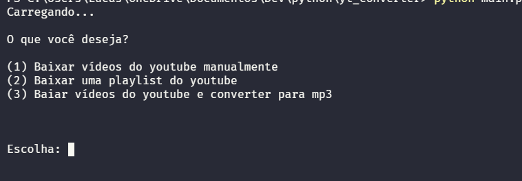
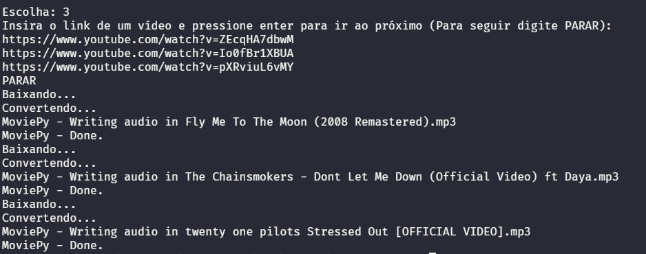
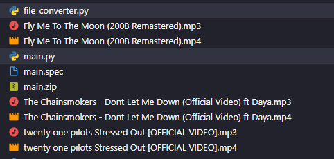

Olá, bem vindos ao meu projeto de um sistema que realiza download de arquivos formato de vídeo e os converte para formato de audio.

Recursos em desenvolvimento..

## Comando de Instalação das bibliotecas

```powershell
> python -m pip install requeriments.txt
```

## Execução

```powershell
> python main.py
```

### Menu principal



### Opção 1

Baixa uma sequência de vídeos (no exemplo apresentado apenas 1) seguindo comando de qualidade.


### Opção 2

Após a inserção do link o download inicia imediatamente, e ao finalizar o processo é encerrado.


### Opção 3

Baixa os vídeos e converte-os para MP3.



